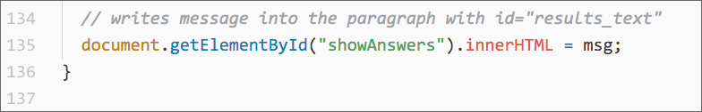
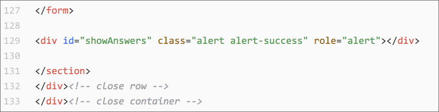

# A Flexible Form Processor

The goal was to adapt a form-processor script written in JavaScript so that beginners could run it locally and have it handle pretty much any HTML form that has a submit button.

This seemed necessary to me because beginner coders have trouble sorting out the `type`, `name`, `id` and `value` attributes of HTML form controls.

1. [form_test.html](https://macloo.github.io/form-processor/form_test.html) uses version 1 of the processor script. It just pops alerts for each name-value pair from the form.

2. [big_form_test.html](https://macloo.github.io/form-processor/big_form_test.html) uses version 4 of the processor script. It writes all the name-value pairs from the form into a `div` that's floated right.

3. [choose_and_read.html](https://macloo.github.io/form-processor/choose_and_read.html) takes your form answers and writes a paragraph, sort of like Mad Libs, in the floated-right `div`. It uses version 5 of the processor script.

4. [quiz_version.html](https://macloo.github.io/form-processor/quiz_version.html) uses version 7 of the processor script. Here it treats the form like a quiz and tells you what you did and did not answer correctly. For this to work, you must go into the script for processor_v7.js and write the name-value pair for each correct answer. Checkboxes and multiple-select elements are handled as arrays.

5. [shoes.html](https://macloo.github.io/form-processor/shoes.html) uses almost the same script; its name is processor_v7_shoes.js. It has a different set of name-value pairs, and if you compare it to processor_v7.js you'll probably understand how that is done. It acts like the form is a quiz even though it isn't, really.

Obviously the quiz versions are too simple for any real quiz, because the quiz-taker could just look at the JavaScript file and see the answers.

## Using arrays vs. using objects

I learned how to use a JavaScript object to simulate an associative array, which is like a dictionary in Python. I worked on this because I didn't like how the original version of the form processor used two separate arrays to hold names and values from the form.

I saved all my versions as I slowly reworked the script. It starts getting good around version 4.

I don't expect JavaScript beginners to understand all the code in the form processor. What they should understand is that the script loops through every object in the form after the submit button is clicked. For anything that has a name, the script will store that name and the associated value into an associative array (an object) named `userAnswers`. If the name has more than one value (this is the case for checkbox sets and for multiple-select elements), the values will be stored in an array.

When that looping and storing is complete, the script can access any name and its value and return it to us. Version 5 and version 7 do that in different ways. Version 5 just writes the values into a paragraph. Version 7 tells us whether the user's answer matches a correct answer (from a separate object named `correctAnswers`.)

## How to use one of these scripts with your own form

If you use [version 5](js/processor_v5.js), the script will write a paragraph. You will edit the function `writeMessage()` (line 102) to use your own form element names. You will not need to change *anything* outside that function! Note that in line 118, either "results_text" must be the `id` of a `p` element within your HTML, or you'll need to re-script how the paragraph gets written onto your page.

If you use [version 7](js/processor_v7.js), you'll need to rewrite only the names and values within the `correctAnswers` object (line 23), and on line 142 is the `id` for a `div` into which the results will be written. If you have an empty `div` with `id="results_text"`, you won't need to change line 142. Nothing else needs to be altered in the script.

## A version for Bootstrap forms

Here is an example of a Bootstrap-styled form using a version of this form-processor script: [Pimp My Shoes](http://macloo.github.io/bootstrap-beginners/bootstrap_form_with_proc.html). The script is very nearly identical to [processor_v7_shoes.js](js/processor_v7_shoes.js) in this repo.

I changed the name of the `id` into which the answers are written:

And this is the line of HTML in the Bootstrap-styled page (line 129) where they will be written:

Here is [a gist for version 7](https://gist.github.com/macloo/c98cc4ab74ab824b806117f94234615c) with extra instructions for beginners.
